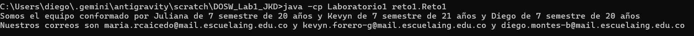
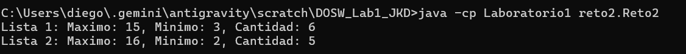
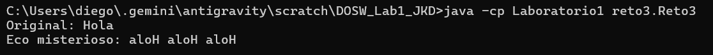
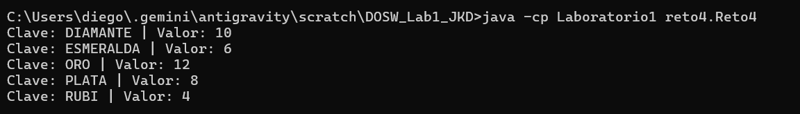
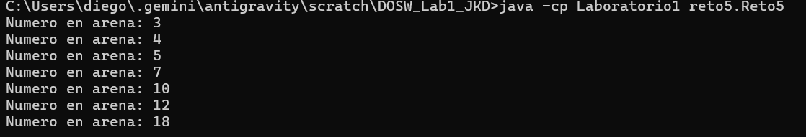

# Git Marathon 2026-1
## **Semester:** 2026-1 

---

## **Team Members**

| **Member** | **GitHub** | **Contact** |
|------------|------------|-------------|
| **Maria Juliana Rodriguez Caicedo** | [@JuliRodC](https://github.com/JuliRodC) | [maria.rodriguez@mail.escuelaing.edu.co](mailto:maria.rodriguez@mail.escuelaing.edu.co) |
| **Kevyn Daniel Forero Gonzalez** | [@kevyn1005](https://github.com/kevyn1005) | [kevyn.forero@mail.escuelaing.edu.co](mailto:kevyn.forero@mail.escuelaing.edu.co) |
| **Diego Alejandro Montes Bonilla** | [@banettchi](https://github.com/banettchi) | [diego.montes@mail.escuelaing.edu.co](mailto:diego.montes@mail.escuelaing.edu.co) |

---

## **Completed Challenges**

| **Challenge** | **Status** | **Completion Date** |
|---------------|------------|---------------------|
| **Challenge 1: La Bienvenida** | Completed | 2026-01-28 | 
| **Challenge 2: Carrera en Paralelo** | Completed | 2026-01-28 | 
| **Challenge 3: El Eco Misterioso** | Completed | 2026-01-28 | 
| **Challenge 4: Llaves Duplicadas** | Completed | 2026-01-28 |
| **Challenge 5: Batalla de Conjuntos** | Completed | 2026-01-28 | 
| **Challenge 6: Maquina de Decisiones** | Completed | 2026-01-28 |  

---

##  **Progress Dashboard (Evidencias)**

### Reto 1

### Reto 2

### Reto 3

### Reto 4

### Reto 5

---

## **Theoretical Questions & Answers**

### 1. ¿Cuál es la diferencia entre git merge y git rebase?
**Respuesta:**
el merge une ramas creando un nuevo commit y guarda la historia tal cual paso, el rebase mueve los cambios al final de la rama como si hubieran pasado despues dejando la historia lineal y mas limpia

### 2. Si dos ramas modifican la misma línea de un archivo, ¿qué sucede al hacer merge?
**Respuesta:**
sale un conflicto de merge y git te dice que hay problemas, toca entrar al archivo manualmente y decidir cual cambio se queda o si se combinan ambos

### 3. ¿Cómo puedes ver gráficamente el historial de merges y ramas en consola?
**Respuesta:**
con el comando `git log --oneline --graph --all` o tambien `git log --graph` sirve para ver el dibujo de las ramas y cruces en la consola

### 4. Explica la diferencia entre un commit y un push.
**Respuesta:**
el commit es guardar los cambios en tu maquina local como una foto, el push es subir esos cambios guardados al servidor de github para que los demas los vean

### 5. ¿Para qué sirven git stash y git pop?
**Respuesta:**
git stash guarda los cambios que no has commiteado en un lugar temporal "escondido" para limpiar el area de trabajo, y git pop los devuelve y los saca del escondite

### 6. ¿Qué diferencia hay entre HashMap y HashTable?
**Respuesta:**
el hashmap es mas rapido pero no es seguro para hilos (no sincronizado) y deja nulos, el hashtable es mas lento pero si es seguro (sincronizado) y no deja usar nulos

### 7. ¿Qué ventajas tiene Collectors.toMap() frente a un bucle tradicional para llenar un mapa?
**Respuesta:**
es mas facil y se escribe menos codigo, hace todo el trabajo de convertir el stream a mapa de una linea y permite manejar duplicados facil con lambdas

### 8. Si usas List con objetos y luego aplicas stream().map(), ¿qué tipo de operación estás haciendo?
**Respuesta:**
estas transformando cada objeto de la lista en otra cosa diferente, por ejemplo sacando solo el nombre del estudiante o cambiando el tipo de dato para procesarlo

### 9. ¿Qué hace el método stream().filter() y qué retorna?
**Respuesta:**
filtra los datos segun una condicion que le pongas en el lambda, retorna un nuevo stream con solo los elementos que pasaron la prueba (true)

### 10. Describe el paso a paso de cómo crear una rama desde develop si es una funcionalidad nueva.
**Respuesta:**
primero te paras en develop con `git checkout develop`, actualizas con `git pull` para tener lo ultimo, y creas la nueva rama con `git checkout -b nombre-rama`

### 11. ¿Cuál es la diferencia entre crear una rama con git branch y con git checkout -b?
**Respuesta:**
git branch crea la rama pero te deja donde estas parado, git checkout -b crea la rama y te mueve a ella de una vez para empezar a trabajar

### 12. ¿Por qué es recomendable crear ramas feature/ para nuevas funcionalidades en lugar de trabajar en main directamente?
**Respuesta:**
para no danar el codigo principal en main que es el que funciona, asi trabajas tranquilo en tu rama feature y solo unes cuando todo este probado y perfecto

# OBSERVACIONES - GENERALES

## OBSERVACIONES - ONBOARDING (INDIVIDUAL)

## NOTA

